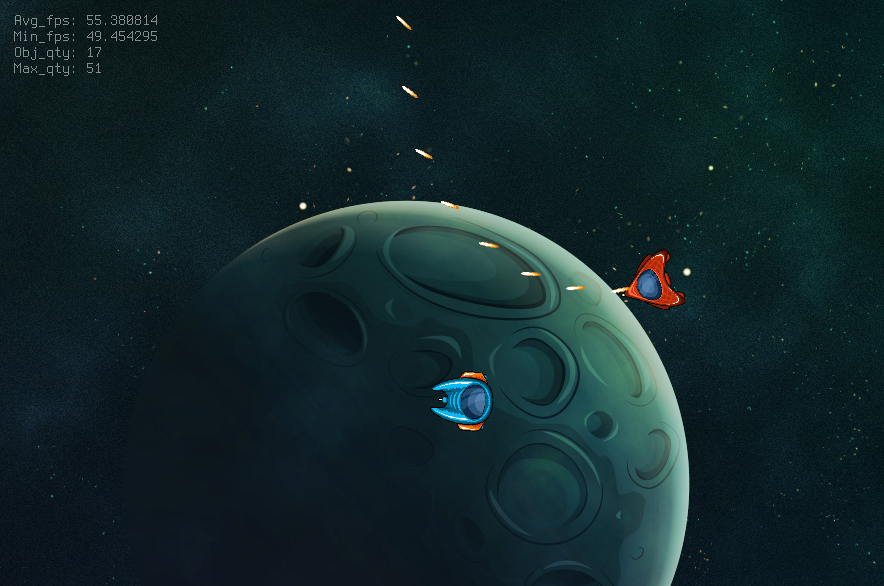

# YA_asteroids



## How to launch on local machine

### Windows 10

0. Install CMake [https://cmake.org/download/](https://cmake.org/download/)
1. Install MinGW [mingw-w64-install.exe](http://sourceforge.net/projects/mingw-w64/files/Toolchains%20targetting%20Win32/Personal%20Builds/mingw-builds/installer/mingw-w64-install.exe/download)
   - Choose i686
2. Download SDL2-devel-x.x.x-mingw.tar.gz from [https://www.libsdl.org/download-2.0.php](https://www.libsdl.org/download-2.0.php)
   - Copy \[bin, include, lib, share\] folders from 'SDL2-x.x.x/i686-w64-mingw32' folder to main MinGW folder (ex. C:\Opt\mingw-w64\mingw32)
   - Do not copy above folders to C:\Opt\mingw-w64\mingw32\i686-w64-mingw32\ subfolder
3. Download SDL2_image-devel-2.0.5-mingw.tar.gz from [https://www.libsdl.org/projects/SDL_image](https://www.libsdl.org/projects/SDL_image)
   - Copy \[bin, include, lib\] folders from 'SDL2_image-x.x.x/i686-w64-mingw32' folder to main MinGW folder (ex. C:\Opt\mingw-w64\mingw32)
   - Do not copy above folders to C:\Opt\mingw-w64\mingw32\i686-w64-mingw32\ subfolder
4. Download SDL2_ttf-devel-x.x.x-mingw.tar.gz from [https://www.libsdl.org/projects/SDL_ttf](https://www.libsdl.org/projects/SDL_ttf)
   - Copy \[bin, include, lib\] folders from 'SDL2_ttf-x.x.x/i686-w64-mingw32' folder to main MinGW folder (ex. C:\Opt\mingw-w64\mingw32)
   - Do not copy above folders to C:\Opt\mingw-w64\mingw32\i686-w64-mingw32\ subfolder
5. Configure make and CMake and run it

### Fedora

```bash
sudo dnf install SDL2-devel SDL2_image-devel SDL2_ttf-devel
```

---

#### Current status

- [x] Spaceships (spaceship 1 keys: W, A, D, SPACE and spaceship 2 keys: UP, LEFT, RIGHT, ENTER)
- [x] Bullets
- [ ] Collisions
- [x] Debug info
- [ ] Extra weapons
- [ ] Extra effects

#### Author

Linkedin: [https://www.linkedin.com/in/slawektuleja/](https://www.linkedin.com/in/slawektuleja/)

#### License

You can use this software freely in any free or commercial project except files placed in 'resources' folder


#### Performance on
    
    Operating System: Fedora 32
    Processors: 16 × AMD Ryzen 7 3700X 8-Core Processor
    Memory: 32 GiB of RAM
    Monitor: LG, screen resolution 4K
    Graphics card: AMD Radeon RX 5700 XT

    # Using runtime inheritance
    1. Avg ~60 FPS with 9700 objects on the screen
    2. Avg ~2700 FPS with 3 objects on the screen
    
    # Without runtime inheritance
    1. Avg ~60 FPS with 8229 objects on the screen
    2. Avg ~2700 FPS with 3 objects on the screen
        
